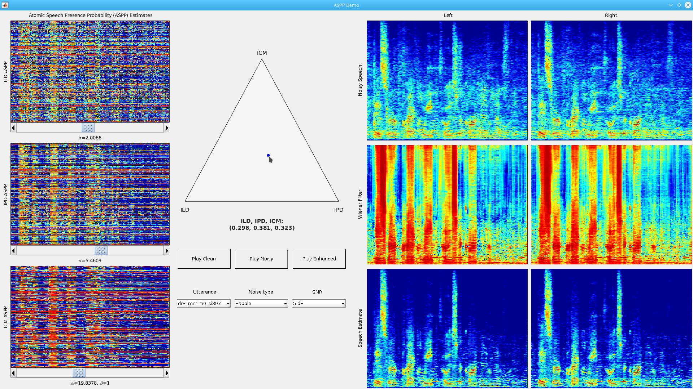

# ASPP: Atomic Speech Presence Probability Estimation

This repository presents an interactive demonstration of the binaural speech enhancement algorithm presented in *Atomic Speech Presence Probability Estimation: Universal Codebook-based Binaural Speech Enhancement* by Sean UN Wood, Johannes KW Stahl, and Pejman Mowlaee.

The demonstration allows for interactive manipulation of various system parameters with real-time visual feedback as well as audio playback of the clean, noisy, and enhanced speech signals.

Starting at the left, we see the ASPP estimates for the different binaural cues: 

- ILD: Interaural level difference
- IPD: Interaural phase difference
- ICM: Interaural coherence magnitude

The ASPP estimates are matrices of size *(number of codebook atoms, number of input frames)*. The sliders below each ASPP control the width or shape parameter of the corresponding ASPP distribution.

The triangle towards the center is used to set the relative weighting of the different ASPPs. The buttons below the triangle may then be used to playback the clean, noisy, and resulting enhanced signals, while the drop-down menus select the example utterance, noise type, and signal to noise ratio (SNRs).

Finally, at the right we see the input noisy speech spectrograms (top), the ASPP-based Wiener filters (middle), and the resulting output speech estimate spectograms (bottom).

### Running the demo

The ASPP demonstration is written in MATLAB and uses the [GUI Layout Toolbox](https://www.mathworks.com/matlabcentral/fileexchange/47982-gui-layout-toolbox) which may either be downloaded manually or installed directly via the MATLAB [add-ons manager](https://www.mathworks.com/help/matlab/matlab_env/manage-your-add-ons.html).

To run the demo:

1. Start MATLAB
1. Navigate to the `aspp-demo` repository root folder
2. Run `runASPPDemo` at the MATLAB command line
